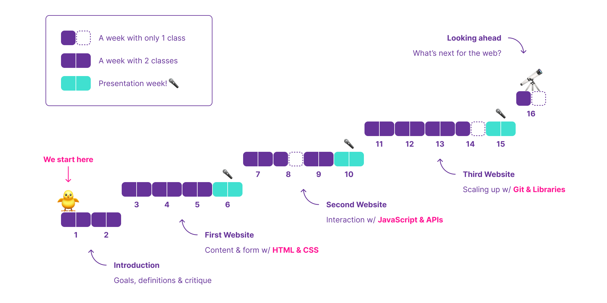
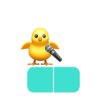
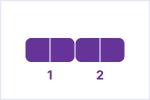
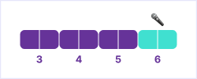
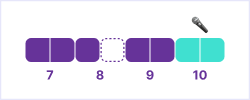
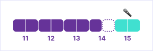
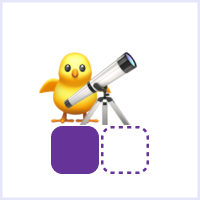

# Syllabus — Front End Fundamentals

This is the main document for the CIM 443/643 course at University of Miami, Fall 2022.

🗓 Classes on Tuesdays and Thursdays, from 12:30pm to 1:45pm.

## About the Course

This course focuses on the job-ready skills and production workflow techniques in high demand for front end web developers. Students will learn, practice and demonstrate the skills and principles needed to make effective use of these technologies.

### Course Goals

By the end of this course, students should be able to:

- Create interactive prototypes for their ideas
- Collaborate with development teams efficiently
- Apply computational thinking skills to other fields

### Course Topics

In order to reach the desired goals, students will learn concepts and techniques related to the 3 core technologies of the web (with an emphasis on the last one):

- 🧱 [HTML](https://developer.mozilla.org/en-US/docs/Learn/Getting_started_with_the_web/HTML_basics) (to define structure and content)
- 🎨 [CSS](https://developer.mozilla.org/en-US/docs/Learn/Getting_started_with_the_web/CSS_basics) (to apply visual styles)
- ✨ [JS](https://developer.mozilla.org/en-US/docs/Learn/Getting_started_with_the_web/JavaScript_basics) (to create interactions)

This course also covers tools that help us organize and scale up our projects:

- [GitHub](https://github.com/) (to collaborate with others – and your future self)
- [React](https://reactjs.org/) (to organize your app into components)
- [CodeSandbox](https://codesandbox.io/) (to use React without installing stuff)

### Course Timeline

We will not learn everything at once. Instead, the course is split into 5 steps. Each step builds on top of what we learned from the previous one. Here is what this progression looks like:

After a couple of weeks of introduction, students begin working on projects. There are 3 individual projects (of increasing complexity) – and students will have around 3 weeks to create each one of them, from ideation to coding.

#### Presentation week

At the end of each project step, we have **presentation week** – imagine this to be you 3× during the semester:

On presentation week, both classes of that week will be dedicated to presentation and discussion of projects. Half of the students present on Tuesday and half on Thursday. Each student has ≈5 min to present their website and get feedback.

After the presentation, students are free to adjust the project (based on that feedback) and submit it for grading (prior to the beginning of the first class of the following week).

### Course Content

#### Introduction

<table>
    <tr>
        <th>Week</th>
        <th>Weekday</th>
        <th>Date</th>
        <th>Preparation</th>
        <th>Content</th>
    </tr>
    <tr>
        <td rowspan=2>1</td>
        <td>Tue</td>
        <td>Aug 23</td>
        <td></td>
        <td>Lorem ipsum dolor sit amet, consectetur adipiscing elit</td>
    </tr>
    <tr>
        <td>Thu</td>
        <td>Aug 25</td>
        <td></td>
        <td>Sed ut eros enim. Sed efficitur convallis blandit</td>
    </tr>
    <tr>
        <td rowspan=2>2</td>
        <td>Tue</td>
        <td>Aug 30</td>
        <td></td>
        <td>Nunc posuere massa mi, in elementum nunc vestibulum eget</td>
    </tr>
    <tr>
        <td>Thu</td>
        <td>Sep 1</td>
        <td></td>
        <td>Maecenas auctor ex sed dolor egestas</td>
    </tr>
</table>

#### First Website

<table>
    <tr>
        <th>Week</th>
        <th>Weekday</th>
        <th>Date</th>
        <th>Preparation</th>
        <th>Content</th>
    </tr>
    <tr>
        <td rowspan=2>3</td>
        <td>Tue</td>
        <td>Sep 6</td>
        <td></td>
        <td>Lorem ipsum dolor sit amet, consectetur adipiscing elit</td>
    </tr>
    <tr>
        <td>Thu</td>
        <td>Sep 8</td>
        <td></td>
        <td>Sed ut eros enim. Sed efficitur convallis blandit</td>
    </tr>
    <tr>
        <td rowspan=2>4</td>
        <td>Tue</td>
        <td>Sep 13</td>
        <td></td>
        <td>Nunc posuere massa mi, in elementum nunc vestibulum eget</td>
    </tr>
    <tr>
        <td>Thu</td>
        <td>Sep 15</td>
        <td></td>
        <td>Maecenas auctor ex sed dolor egestas</td>
    </tr>
    <tr>
        <td rowspan=2>5</td>
        <td>Tue</td>
        <td>Sep 20</td>
        <td></td>
        <td>Lorem ipsum dolor sit amet, consectetur adipiscing elit</td>
    </tr>
    <tr>
        <td>Thu</td>
        <td>Sep 22</td>
        <td></td>
        <td>Sed ut eros enim. Sed efficitur convallis blandit</td>
    </tr>
    <tr>
        <td rowspan=2>6</td>
        <td>Tue</td>
        <td>Sep 27</td>
        <td></td>
        <td>Nunc posuere massa mi, in elementum nunc vestibulum eget</td>
    </tr>
    <tr>
        <td>Thu</td>
        <td>Sep 29</td>
        <td></td>
        <td>Maecenas auctor ex sed dolor egestas</td>
    </tr>
</table>

#### Second Website

<table>
    <tr>
        <th>Week</th>
        <th>Weekday</th>
        <th>Date</th>
        <th>Preparation</th>
        <th>Content</th>
    </tr>
    <tr>
        <td rowspan=2>7</td>
        <td>Tue</td>
        <td>Oct 4</td>
        <td></td>
        <td>Lorem ipsum dolor sit amet, consectetur adipiscing elit</td>
    </tr>
    <tr>
        <td>Thu</td>
        <td>Oct 6</td>
        <td></td>
        <td>Sed ut eros enim. Sed efficitur convallis blandit</td>
    </tr>
    <tr>
        <td rowspan=2>8</td>
        <td>Tue</td>
        <td>Oct 11</td>
        <td></td>
        <td>Nunc posuere massa mi, in elementum nunc vestibulum eget</td>
    </tr>
    <tr>
        <td>Thu</td>
        <td>Oct 13</td>
        <td></td>
        <td>🚫 No class</td>
    </tr>
    <tr>
        <td rowspan=2>9</td>
        <td>Tue</td>
        <td>Oct 18</td>
        <td></td>
        <td>Lorem ipsum dolor sit amet, consectetur adipiscing elit</td>
    </tr>
    <tr>
        <td>Thu</td>
        <td>Oct 20</td>
        <td></td>
        <td>Sed ut eros enim. Sed efficitur convallis blandit</td>
    </tr>
    <tr>
        <td rowspan=2>10</td>
        <td>Tue</td>
        <td>Oct 25</td>
        <td></td>
        <td>Nunc posuere massa mi, in elementum nunc vestibulum eget</td>
    </tr>
    <tr>
        <td>Thu</td>
        <td>Oct 27</td>
        <td></td>
        <td>Maecenas auctor ex sed dolor egestas</td>
    </tr>
</table>

#### Third Website

<table>
    <tr>
        <th>Week</th>
        <th>Weekday</th>
        <th>Date</th>
        <th>Preparation</th>
        <th>Content</th>
    </tr>
    <tr>
        <td rowspan=2>11</td>
        <td>Tue</td>
        <td>Nov 1</td>
        <td></td>
        <td>Lorem ipsum dolor sit amet, consectetur adipiscing elit</td>
    </tr>
    <tr>
        <td>Thu</td>
        <td>Nov 3</td>
        <td></td>
        <td>Sed ut eros enim. Sed efficitur convallis blandit</td>
    </tr>
    <tr>
        <td rowspan=2>12</td>
        <td>Tue</td>
        <td>Nov 8</td>
        <td></td>
        <td>Nunc posuere massa mi, in elementum nunc vestibulum eget</td>
    </tr>
    <tr>
        <td>Thu</td>
        <td>Nov 10</td>
        <td></td>
        <td>Maecenas auctor ex sed dolor egestas</td>
    </tr>
    <tr>
        <td rowspan=2>13</td>
        <td>Tue</td>
        <td>Nov 15</td>
        <td></td>
        <td>Lorem ipsum dolor sit amet, consectetur adipiscing elit</td>
    </tr>
    <tr>
        <td>Thu</td>
        <td>Nov 17</td>
        <td></td>
        <td>Sed ut eros enim. Sed efficitur convallis blandit</td>
    </tr>
    <tr>
        <td rowspan=2>14</td>
        <td>Tue</td>
        <td>Nov 22</td>
        <td></td>
        <td>Nunc posuere massa mi, in elementum nunc vestibulum eget</td>
    </tr>
    <tr>
        <td>Thu</td>
        <td>Nov 24</td>
        <td></td>
        <td>🚫 No class</td>
    </tr>
    <tr>
        <td rowspan=2>15</td>
        <td>Tue</td>
        <td>Nov 29</td>
        <td></td>
        <td>Lorem ipsum dolor sit amet, consectetur adipiscing elit</td>
    </tr>
    <tr>
        <td>Thu</td>
        <td>Dec 1</td>
        <td></td>
        <td>Sed ut eros enim. Sed efficitur convallis blandit</td>
    </tr>
</table>

#### Looking Ahead

<table>
    <tr>
        <th>Week</th>
        <th>Weekday</th>
        <th>Date</th>
        <th>Preparation</th>
        <th>Content</th>
    </tr>
    <tr>
        <td rowspan=2>16</td>
        <td>Tue</td>
        <td>Dec 6</td>
        <td></td>
        <td>Lorem ipsum dolor sit amet, consectetur adipiscing elit</td>
    </tr>
    <tr>
        <td>Thu</td>
        <td>Dec 8</td>
        <td></td>
        <td>🚫 No class</td>
    </tr>
</table>

<!--
### Course Topics

The schedule will evolve as the semester goes on. These are some topics we’ll cover during the semester.

- Setting up a development environment
- Using different CSS units
- Advanced CSS selectors & variables
- Animating changes with CSS
- Basic JavaScript & related programming concepts
- DOM Scripting
- Useful JavaScript libraries like jQuery, Highcharts.js, and Waypoints
- Web frameworks like Jekyll and React

### Resources & Materials for class

I will provide you with relevant readings digitally. You will need access to either the Google Suite (Docs, Sheets, Slides, etc.) or the Microsoft Office Suite (Word, Excel).

#### JavaScript for Web Designers

This is the only book you’ll need for the class. It’s a wonderful introduction to JavaScript concepts we’ll cover, and it’s not too pricey. You can order it directly from A Book Apart
or find it on Amazon. Please don’t buy the book until after our first lecture.

#### Codepen

We’ll be using Codepen to prototype and practice concepts quickly. You will be fine with just the free tier.

#### GitHub

We’ll be using GitHub to back up, share, and publish our code.

-->

## Grading

I reserve the right to adjust the final grade according to class participation, attendance, overall
quality of work, etc.

### Grading 

<table>
    <tr>
        <th>Step</th>
        <th>Assignment</th>
        <th>Points</th>
    </tr>
    <tr>
        <td>Introduction</td>
        <td>…</td>
        <td>5</td>
    </tr>
    <tr>
        <td rowspan=3>First website</td>
        <td>…</td>
        <td>10</td>
    </tr>
    <tr>
        <td>…</td>
        <td>10</td>
    </tr>
    <tr>
        <td>…</td>
        <td>10</td>
    </tr>
    <tr>
        <td rowspan=3>Second website</td>
        <td>…</td>
        <td>10</td>
    </tr>
    <tr>
        <td>…</td>
        <td>10</td>
    </tr>
    <tr>
        <td>…</td>
        <td>10</td>
    </tr>
    <tr>
        <td rowspan=3>Third website</td>
        <td>…</td>
        <td>10</td>
    </tr>
    <tr>
        <td>…</td>
        <td>10</td>
    </tr>
    <tr>
        <td>…</td>
        <td>10</td>
    </tr>
    <tr>
        <td>Looking ahead</td>
        <td>…</td>
        <td>5</td>
    </tr>
</table>

### Grading Scale

Grade | Points
---|---
A+ | 100
A | ≥ 95
A- | ≥ 90
B+ | ≥ 87
B | ≥ 84
B- | ≥ 80
C+ | ≥ 77
C | ≥ 74
C- | ≥ 70
D+ | ≥ 67
D | ≥ 60
F | ≥ 0

## Office Hours

TBA

## Policies

### Religious Holy Day Policy

It is your responsibility to let me know when you’ll be absent for religious holy days at the start of term. You will still be responsible for material covered in class on holy days.

### Contact Policy

All class communications will be via ~~Discord~~ Blackboard; please check daily, especially the night before class. I will use ~~Discord~~ Blackboard to communicate with you in case of cancellations, deadlines, etc. You may email me as needed, but I need at least 24 hours to respond to your email, and I will not read emails after 9 pm and on weekends.

### Honor Code

You are expected to abide by the University of Miami Honor Code. The Honor Code aims to protect the University’s academic integrity by encouraging consistent ethical behavior in assigned coursework. Academic dishonesty of any kind, for whatever reason, will not be tolerated.

There is an expectation that if you are attending a class live, you’ll be an active participant; the university believes an effective way of achieving this is by sharing your video feed during the class.

The University has provided the following language related to lecture recordings:

Students are expressly prohibited from recording any part of this course. Meetings of this course might be recorded by the University. Any recordings will be available to students registered for this class as they are intended to supplement the classroom experience.

Students are expected to follow appropriate University policies and maintain the security of passwords used to access recorded lectures. Recordings may not be reproduced, shared with those not in the class, or uploaded to other online environments. If the instructor or a University of Miami office plans any other uses for the recordings, beyond this class, students identifiable in the recordings will be notified to request consent prior to such use.