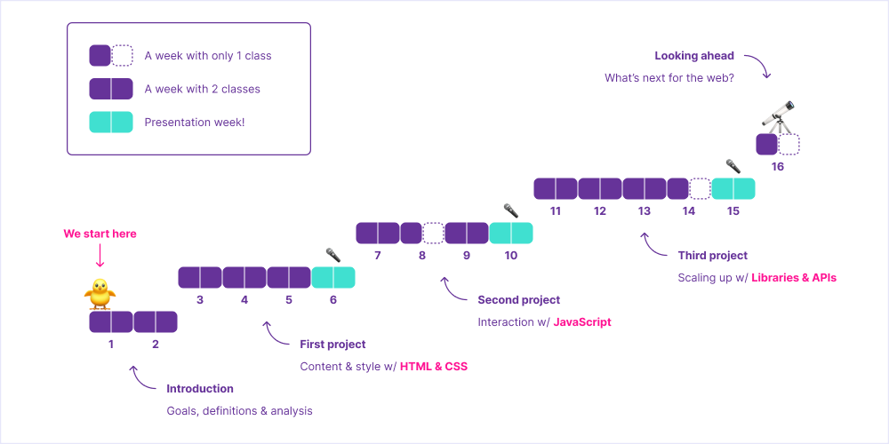

# Syllabus — Front End Fundamentals

This is the main document for the CIM 443/643 course at University of Miami, Fall 2022.

## About the course

This course focuses on the job-ready skills and production workflow techniques in high demand for front end web developers. Students will learn, practice and demonstrate the skills and principles needed to make effective use of these technologies.

### Course Goal & Objectives

- Provide an introduction to JavaScript.
- Provide experience building interactive websites and modules.
- Provide a foundation for working on web development projects independently.
- Provide practice creating modern, adaptable layouts.

### Course Timeline

#### Introduction

#### First website

#### Second website

#### Third website

#### Presentation week

#### Looking ahead

### Course Topics

The schedule will evolve as the semester goes on. These are some topics we’ll cover during the semester.

- Setting up a development environment
- Using different CSS units
- Advanced CSS selectors & variables
- Animating changes with CSS
- Basic JavaScript & related programming concepts
- DOM Scripting
- Useful JavaScript libraries like jQuery, Highcharts.js, and Waypoints
- Web frameworks like Jekyll and React

### Resources & Materials for class

I will provide you with relevant readings digitally. You will need access to either the Google Suite (Docs, Sheets, Slides, etc.) or the Microsoft Office Suite (Word, Excel).

#### JavaScript for Web Designers

This is the only book you’ll need for the class. It’s a wonderful introduction to JavaScript concepts we’ll cover, and it’s not too pricey. You can order it directly from A Book Apart
or find it on Amazon. Please don’t buy the book until after our first lecture.

#### Codepen

We’ll be using Codepen to prototype and practice concepts quickly. You will be fine with just the free tier.

#### GitHub

We’ll be using GitHub to back up, share, and publish our code.

## Grading

I reserve the right to adjust the final grade according to class participation, attendance, overall
quality of work, etc.

### Grading Breakdown

- Discussions & Exercises: 50%
- Project 1: 25%
- Project 2: 25%

### Grade Scale

- A: ≥ 90
- B: 80 – 89
- C: 70 – 79
- D: 60 – 69
- F: ≤ 59

## Office Hours

TBA

## Policies

### Religious Holy Day Policy

It is your responsibility to let me know when you’ll be absent for religious holy days at the start of term. You will still be responsible for material covered in class on holy days.

### Contact Policy

All class communications will be via ~~Discord~~ Blackboard; please check daily, especially the night before class. I will use ~~Discord~~ Blackboard to communicate with you in case of cancellations, deadlines, etc. You may email me as needed, but I need at least 24 hours to respond to your email, and I will not read emails after 9 pm and on weekends.

### Honor Code

You are expected to abide by the University of Miami Honor Code. The Honor Code aims to protect the University’s academic integrity by encouraging consistent ethical behavior in assigned coursework. Academic dishonesty of any kind, for whatever reason, will not be tolerated.

There is an expectation that if you are attending a class live, you’ll be an active participant; the university believes an effective way of achieving this is by sharing your video feed during the class.

The University has provided the following language related to lecture recordings:

Students are expressly prohibited from recording any part of this course. Meetings of this course might be recorded by the University. Any recordings will be available to students registered for this class as they are intended to supplement the classroom experience.

Students are expected to follow appropriate University policies and maintain the security of passwords used to access recorded lectures. Recordings may not be reproduced, shared with those not in the class, or uploaded to other online environments. If the instructor or a University of Miami office plans any other uses for the recordings, beyond this class, students identifiable in the recordings will be notified to request consent prior to such use.