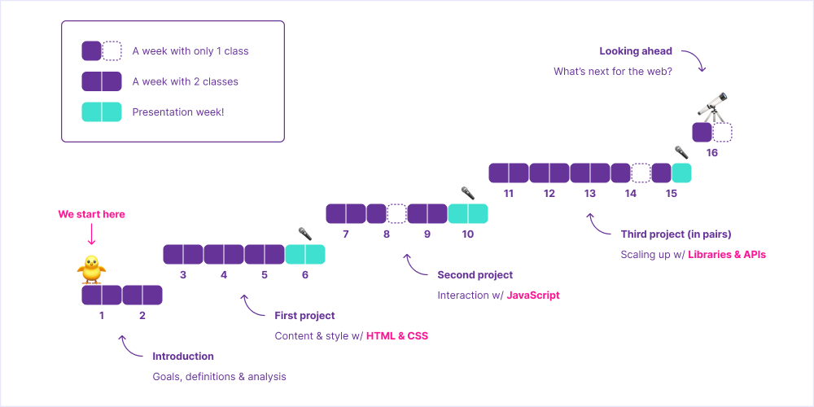
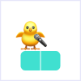
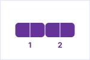
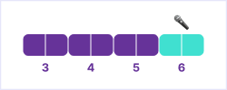
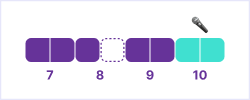
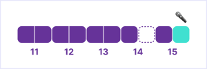
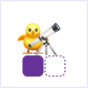

# Syllabus — Front End Fundamentals

This is the main document for the CIM 443/643 course at University of Miami, Fall 2022.

🗓 Classes on Tuesdays and Thursdays, from `12:30` to `1:45 pm`.

Lecturer | Email
---|---
Vinicius Sueiro | hi@vsueiro.com

Last updated on Nov 3, 2022. This document is subject to change.

## About the Course

This course focuses on the job-ready skills and production workflow techniques in high demand for front end web developers. Students will learn, practice and demonstrate the skills and principles needed to make effective use of these technologies.

### Course Goals

By the end of this course, students should be able to:

- Materialize ideas as interactive websites
- Collaborate with development teams efficiently
- Apply computational thinking skills to other fields

### Course Topics

In order to reach the desired goals, students will learn concepts and techniques related to the 3 core technologies of the web (with an emphasis on the last one):

- 🧱 [HTML](https://developer.mozilla.org/en-US/docs/Learn/Getting_started_with_the_web/HTML_basics) (to define structure and content)
- 🎨 [CSS](https://developer.mozilla.org/en-US/docs/Learn/Getting_started_with_the_web/CSS_basics) (to apply visual styles)
- ✨ [JS](https://developer.mozilla.org/en-US/docs/Learn/Getting_started_with_the_web/JavaScript_basics) (to create interactions)

This course also covers tools that help us organize and scale up our projects:

- [CodeSandbox](https://codesandbox.io/) (to write code without installing stuff)
- [React](https://reactjs.org/) (to organize your website into components)

Optionally:
- [Vercel](https://vercel.com/) (to easily deploy your website)
- [Visual Studio Code](https://code.visualstudio.com/) (to write code as files in your own computer)
- [GitHub](https://github.com/) (to collaborate with others – and your future self)
- [Google Domains](https://domains.google/) (to rent a friendly name, like  “example.com”)

All tools are free (or provide a free version), except Google Domains. 💸

### Course Timeline

We will not learn everything at once. Instead, this 16-week course is split into 5 steps. Each step builds on top of what we learned from the previous one. Here is what this progression looks like:



After a couple of weeks of introduction, students begin working on projects. There are 3 individual projects (of increasing complexity) – and students will have around 3 weeks to create each one of them, from idea to coding.

#### Presentation week

At the end of each project step, we have **presentation week** – imagine this to be you 3× during the semester:



On presentation week, both classes of that week will be dedicated to presentation and discussion of projects. Half of the students present on Tuesday and half on Thursday. Each student has about 5 minutes to present their project and get feedback.

After the presentation, students are free to adjust the project (based on that feedback) and submit it for grading (prior to the beginning of the first class of the following week).

### Course Content

The following tables briefly describe what we will be doing during class (“Content”) and what you are expected to do before each class (“Preparation”).

#### Introduction


<table>
    <tr>
        <th>Week</th>
        <th>Date</th>
        <th>Preparation</th>
        <th>Content</th>
        <th>Materials</th>
    </tr>
    <tr>
        <td rowspan=2>1</td>
        <td>Aug 23</td>
        <td></td>
        <td>Discussing course goals, topics, tools, timeline & grading</td>
        <td></td>
    </tr>
    <tr>
        <td>Aug 25</td>
        <td>
            Watch <a href="https://youtu.be/TNQsmPf24go">this</a> to learn how the “cloud” is actually a <em>very</em> tangible thing
            <br><br>
            Watch <a href="https://youtu.be/YoXxevp1WRQ?t=313">this</a>, from <code>5:13</code> to <code>41:54</code>, to learn how computers cleverly represent numbers, text, color, images & even emoji
            <br><br>
            Sign up for <a href="https://codesandbox.io/">CodeSandbox</a>
        </td>
        <td>
            Exploring the anatomy of the web:
            servers (back end) & clients (front end)
            <br><br>
            Coding the <em>simplest</em> website (HTML)
        </td>
        <td></td>
    </tr>
    <tr>
        <td rowspan=2>2</td>
        <td>Aug 30</td>
        <td>
            Watch <a href="https://youtu.be/ysEN5RaKOlA">this</a> to quickly grasp the full jargon of web development
            <br><br>
            Watch <a href="https://www.youtube.com/watch?v=NTdRuYSOpV0">this</a> to hear from a pro how problem solving is more relevant than memorizing
        </td>
        <td>
            Coding a website with a simple style (CSS) <s>& interaction (JS)</s>
        </td>
        <td><a href="lectures/cloud-myth">Topics</a></td>
    </tr>
    <tr>
        <td>Sep 1</td>
        <td>
            Pick a website you <strong>hate</strong> using
            <br><br>
            Pick a website you <strong>love</strong> using
        </td>
        <td>Analyzing examples & discussing improvements</td>
        <td>
            <a href="https://codesandbox.io/s/personal-site-warm-up-g3bzwr?file=/index.html">Sandbox</a>
        </td>
    </tr>
</table>

##### Assignment: 🔍 Analysis 
```
Pick a website you hate using.
Pick another website you love using.
For each of them, submit the following:

• 📱 Screen capture or recording
• URL (https://example.com)
• What do you use it for?
• Why do you hate or love using it?
• How could it be improved?
• How could those improvements be implemented?

Due Sep 6, via Google Forms (exceptionally).
```
[Answer the Google Form ↗](https://forms.gle/NaRyGnFrXDarSzxF9)

#### First Project: Personal Site


<table>
    <tr>
        <th>Week</th>
        <th>Date</th>
        <th>Preparation</th>
        <th>Content</th>
        <th>Materials</th>
    </tr>
    <tr>
        <td rowspan=2>3</td>
        <td>Sep 6</td>
        <td>
            Watch <a href="https://youtu.be/5g0x2xv3aHU?t=3155">this</a>, from <code>52:35</code> to <code>1:52:34</code>, to better understand the potential of HTML & CSS
            <br><br>
            Read <a href="https://medium.com/@valgaze/the-hidden-purple-memorial-in-your-web-browser-7d84813bb416">this</a> to remember <em>humans</em> are behind all technology
        </td>
        <td>
            Presenting project goals, deliveries and due dates
            <br><br>
            Coding a minimalist personal site (one page)
        </td>
        <td>
            <a href="lectures/planning-example">
                Planning example
            </a>
            <br><br>
            <a href="https://codesandbox.io/s/personal-site-dog-5o8mfx">
                Sandbox (pre-coded)
            </a>
            <br><br>
            <a href="https://codesandbox.io/s/mr-corgi-tecwiq">
                Sandbox
            </a>
        </td>
    </tr>
    <tr>
        <td>Sep 8</td>
        <td>
            Read <a href="https://developer.mozilla.org/en-US/docs/Learn/HTML/Introduction_to_HTML/Document_and_website_structure">this</a> to learn how to structure whole <em>pages</em> with meaningful HTML tags
        </td>
        <td>
            Coding a more complex personal site (multiple pages)
        </td>
        <td>
            <a href="https://codesandbox.io/s/multi-page-website-ckvy9z">
                Sandbox
            </a>
        </td>
    </tr>
    <tr>
        <td rowspan=2>4</td>
        <td>Sep 13</td>
        <td>Plan your website</td>
        <td>
            ✨ In person ✨
            <br><br>
            Translating your content into a semantic (meaningful) HTML structure
        </td>
        <td></td>
    </tr>
    <tr>
        <td>Sep 15</td>
        <td>
            Read <a href="https://developer.mozilla.org/en-US/docs/Learn/Getting_started_with_the_web/CSS_basics">this</a> to better understand the basics of CSS
        </td>
        <td>Translating your sketch into CSS properties and values</td>
        <td>
            <a href="https://codesandbox.io/s/flex-icons-zgvidb?file=/style.css">Sandbox</a>
        </td>
    </tr>
    <tr>
        <td rowspan=2>5</td>
        <td>Sep 20</td>
        <td>Take note of 1-3 tasks you need help with</td>
        <td>Pairing up with classmates to help each other (instructor may intervene)</td>
        <td>
            <a href="https://codesandbox.io/s/transform-transition-d80miw">Sandbox (pre-coded)</a>
        </td>
    </tr>
    <tr>
        <td>Sep 22</td>
        <td></td>
        <td>Pairing up with classmates to help each other (instructor may intervene)</td>
        <td>
            <!--
            <a href="https://youtu.be/SZ7ar_vGMVE">▶️ Pixels Under Microscope</a>
            <br><br>
            -->
            <a href="https://codesandbox.io/s/color-animation-dxc52e">
            Sandbox
            </a>
            <br><br>
            <a href="https://codesandbox.io/s/loading-animation-2wxh9o">Sandbox (pre-coded)</a>
            <br><br>
            <a href="https://codesandbox.io/s/pulse-animation-cmg9sm">Sandbox (pre-coded)</a>
        </td>
    </tr>
    <tr>
        <td rowspan=2>6</td>
        <td>Sep 27</td>
        <td>Sign up for a presentation slot (½ of the students)</td>
        <td>Presenting your work & getting feedback</td>
        <td></td>
    </tr>
    <tr>
        <td>Sep 29</td>
        <td>Sign up for a presentation slot (½ of the students)</td>
        <td>Presenting your work & getting feedback</td>
        <td></td>
    </tr>
</table>

##### Assignment: ✏️ Planning
```
Plan your website:

• What is its purpose?
• What is its content?
• What could it look like?

Due Sep 13, via Google Forms (exceptionally).
```

[Answer the Google Form ↗](https://forms.gle/wNnbJfmdioj9AHdM9)

##### Assignment: 🎤 Presentation
```
Present your website (5 min):

• Goals
• Process
• Learnings

Due Sep 27 or 29, during class.
```

[Sign up for a presentation slot ↗](https://docs.google.com/spreadsheets/d/19L6CDpw94xk3K233FHQ6ju__e2-l8Y5FVlgx0qD8dWI/edit)


##### Assignment: 💻 Submission
```
Submit your website:

• URL
• Screen capture or recording
• Answers to reflective questions about your project

Due Oct 4, via Google Forms.
```

[Submit via Google Forms ↗](https://forms.gle/d6ci9FUNDGcSKt4p8)


#### Second Project: Quiz


<table>
    <tr>
        <th>Week</th>
        <th>Date</th>
        <th>Preparation</th>
        <th>Content</th>
        <th>Materials</th>
    </tr>
    <tr>
        <td rowspan=2>7</td>
        <td>Oct 4</td>
        <td>
            Watch <a href="https://youtu.be/YoXxevp1WRQ?t=2514">this</a>, from <code>41:54</code> to <code>1:25:18</code>, to learn how to break complex tasks into simple step-by-step instructions
        </td>
        <td>
            Presenting project goals, deliveries and due dates
            <br><br>
            Discussing algorithms, data types & structures
        </td>
        <td>
            <a href="https://codesandbox.io/s/like-counter-6jfy9s?file=/script.js">Sandbox</a>
        </td>
    </tr>
    <tr>
        <td>Oct 6</td>
        <td>
            Watch <a href="https://youtu.be/5g0x2xv3aHU?t=6774">this</a>, from <code>1:50:50</code> to <code>2:25:40</code>, to learn the basics of JavaScript
        </td>
        <td>Coding a simple quiz with JavaScript</td>
        <td>
            <a href="https://codesandbox.io/s/quiz-single-question-7deoh8">Sandbox</a>
        </td>
    </tr>
    <tr>
        <td rowspan=2>8</td>
        <td>Oct 11</td>
        <td>Plan your website</td>
        <td>Coding a quiz with a score & lots of questions</td>
        <td></td>
    </tr>
    <tr>
        <td>Oct 13</td>
        <td></td>
        <td>🚫 No class</td>
        <td></td>
    </tr>
    <tr>
        <td rowspan=2>9</td>
        <td>Oct 18</td>
        <td>Take note of 1-3 tasks you need help with</td>
        <td>Pairing up with classmates to help each other (instructor may intervene)</td>
        <td></td>
    </tr>
    <tr>
        <td>Oct 20</td>
        <td></td>
        <td>Pairing up with classmates to help each other (instructor may intervene)</td>
        <td></td>
    </tr>
    <tr>
        <td rowspan=2>10</td>
        <td>Oct 25</td>
        <td>Sign up for a presentation slot (½ of the students)</td>
        <td>Presenting your work & getting feedback</td>
        <td></td>
    </tr>
    <tr>
        <td>Oct 27</td>
        <td>Sign up for a presentation slot (½ of the students)</td>
        <td>Presenting your work & getting feedback</td>
        <td></td>
    </tr>
</table>

##### Assignment: ✏️ Planning
```
Plan your website:

• What is its purpose?
• What is its content?
• What could it look like?

Due Oct 11, via Google Forms.
```
[Answer the Google Form ↗](https://forms.gle/CbSQrhgBKEu59NJF6)

##### Assignment: 🎤 Presentation
```
Present your website (5 min):

• Goals
• Demonstration (classmates as play testers, ideally)
• Learnings

Due Oct 25 or 27, during class.
```

[Sign up for a presentation slot ↗](https://docs.google.com/spreadsheets/d/19L6CDpw94xk3K233FHQ6ju__e2-l8Y5FVlgx0qD8dWI/edit#gid=1551064258)


##### Assignment: 💻 Submission
```
Submit your website:

• URL
• Screen capture or recording
• Answers to reflective questions about your project

Due Nov 1, via Google Forms.
```

[Submit via Google Forms ↗](https://forms.gle/6aKd8EtHYfvD1CBH7)

#### Third Project: Dynamic Site


This project should be conducted in **pairs**.

##### Rubric

You (and your pair) are free to choose the topic of your project. Here is how you will be evaluated (pairs will obtain the same grade):

- Usage of semantic HTML: 3 points
- Usage of responsive CSS: 3 points
- Usage of third-party APIs or JS libraries: 4 points

<table>
    <tr>
        <th>Week</th>
        <th>Date</th>
        <th>Preparation</th>
        <th>Content</th>
        <th>Materials</th>
    </tr>
    <tr>
        <td rowspan=2>11</td>
        <td>Nov 1</td>
        <td></td>
        <td>
            Presenting project goals, deliveries and due dates
            <br><br>
            Coding a simple dynamic page with Fetch API
        </td>
        <td>
            <a href="lectures/apis">List of Free APIs</a>
            <br><br>
            <a href="https://codesandbox.io/s/api-request-64yl89">Sandbox</a>
            <br><br>
            <a href="https://codesandbox.io/s/not-bored-7nzdnz">Sandbox</a> 
        </td>
    </tr>
    <tr>
        <td>Nov 3</td>
        <td></td>
        <td>Exploring a variety of APIs and Libraries</td>
        <td>
            <a href="lectures/libraries">List of Free Libraries</a>
        </td>
    </tr>
    <tr>
        <td rowspan=2>12</td>
        <td>Nov 8</td>
        <td>Plan your website</td>
        <td>Coding a dynamic page with Google Sheets API</td>
        <td></td>
    </tr>
    <tr>
        <td>Nov 10</td>
        <td></td>
        <td>Coding a simple page with React</td>
        <td></td>
    </tr>
    <tr>
        <td rowspan=2>13</td>
        <td>Nov 15</td>
        <td>Take note of 1-3 tasks you need help with</td>
        <td>Debug session</td>
        <td></td>
    </tr>
    <tr>
        <td>Nov 17</td>
        <td>Take note of 1-3 tasks you need help with</td>
        <td>Debug session</td>
        <td></td>
    </tr>
    <tr>
        <td rowspan=2>14</td>
        <td>Nov 22</td>
        <td>Submit a question via Google Forms</td>
        <td>Answering most common questions from students (Zoom recording)</td>
        <td></td>
    </tr>
    <tr>
        <td>Nov 24</td>
        <td></td>
        <td>🚫 No class</td>
        <td></td>
    </tr>
    <tr>
        <td rowspan=2>15</td>
        <td>Nov 29</td>
        <td>Take note of 1-3 tasks you need help with</td>
        <td>Debug session</td>
        <td></td>
    </tr>
    <tr>
        <td>Dec 1</td>
        <td>Sign up for a presentation slot (½ of the students)</td>
        <td>Presenting your work & getting feedback</td>
        <td></td>
    </tr>
</table>

##### Assignment: ✏️ Planning
```
Plan your website:

• What is its purpose?
• What is its content?
• What could it look like?

Due Nov 8, via Google Forms.
```

[Answer the Google Form ↗](https://forms.gle/WDwhEBvrdkWxuq2V6)

##### Assignment: 🎤 Presentation
```
Present your website (5 min):

• Goals
• Process
• Learnings

Due Dec 1, during class.
```

##### Assignment: 💻 Submission
```
Submit your website:

• URL
• Screen capture or recording
• Answers to reflective questions about your project

Due Dec 6, via Google Forms.
```

#### Looking Ahead


<table>
    <tr>
        <th>Week</th>
        <th>Weekday</th>
        <th>Date</th>
        <th>Preparation</th>
        <th>Content</th>
    </tr>
    <tr>
        <td rowspan=2>16</td>
        <td>Tue</td>
        <td>Dec 6</td>
        <td>
            <code>Optional</code>
            <br>
            Read about no-code tools, AI “copilots”, native apps, 3D environments, tangible interfaces or the so-called “Web3”
        </td>
        <td>Discussing the future of the web – and paths we can take</td>
    </tr>
    <tr>
        <td>Thu</td>
        <td>Dec 8</td>
        <td></td>
        <td>🚫 No class</td>
    </tr>
</table>

##### Assignment: 🔭 Self-reflection 
```
Submit a self-reflection considering:

• Your experience learning about web development
• How it relates to your future pursuits (personal & professional)

The format could either be:

• Written (up to a page); or
• Video recording (up to 5 minutes)

Feel free to include sketches, photos or any other media.

Due Dec 9, via Google Forms (instead of Final Exam).
```

## Grading

I reserve the right to adjust the final grade according to class participation, attendance, overall
quality of work, etc.

### Grading Breakdown

<table>
    <tr>
        <th>Step</th>
        <th>Assignment</th>
        <th>Points</th>
    </tr>
    <tr>
        <td>Introduction</td>
        <td>🔍 &nbsp;Analysis</td>
        <td>5</td>
    </tr>
    <tr>
        <td rowspan=3>First Project</td>
        <td>✏️ &nbsp;Planning</td>
        <td>10</td>
    </tr>
    <tr>
        <td>🎤 &nbsp;Presentation</td>
        <td>10</td>
    </tr>
    <tr>
        <td>💻 &nbsp;Submission</td>
        <td>10</td>
    </tr>
    <tr>
        <td rowspan=3>Second Project</td>
        <td>✏️ &nbsp;Planning</td>
        <td>10</td>
    </tr>
    <tr>
        <td>🎤 &nbsp;Presentation</td>
        <td>10</td>
    </tr>
    <tr>
        <td>💻 &nbsp;Submission</td>
        <td>10</td>
    </tr>
    <tr>
        <td rowspan=3>Third Project</td>
        <td>✏️ &nbsp;Planning</td>
        <td>10</td>
    </tr>
    <tr>
        <td>🎤 &nbsp;Presentation</td>
        <td>10</td>
    </tr>
    <tr>
        <td>💻 &nbsp;Submission</td>
        <td>10</td>
    </tr>
    <tr>
        <td>Looking ahead</td>
        <td>🔭 &nbsp;Self-reflection</td>
        <td>5</td>
    </tr>
</table>

### Grading Scale

Grade | Points
---|---
A+ | ≥ 97
A | ≥ 93
A- | ≥ 90
B+ | ≥ 87
B | ≥ 83
B- | ≥ 80
C+ | ≥ 77
C | ≥ 70
D+ | ≥ 65
D | ≥ 60
F | ≥ 0

## Office Hours

Students may schedule individual sessions with the instructor. Please use [Calendly](https://calendly.com/vsueiro/office-hours) to pick a specific time slot for our remote (Zoom) meeting.

## Policies

### Religious Holy Day Policy

It is the student’s obligation to provide faculty members with notice of the dates they will be absent for religious holy days. Students are responsible for material covered in class regardless of their presence. The University’s complete Religious Holy Day Policy can be found in the current Bulletin.

### Attendance Policy
Class attendance is critical to the success of this hands-on class, including class participation in discussions and completion of in-class assignments. All students are responsible for material covered in the classroom regardless of their presence; therefore, check the Blackboard class for announcements and assignment requirements and due dates. Do not email your instructor to find out what has been posted to Blackboard. Late work will not be accepted unless an extension has formally been requested prior to the deadline and approved on a needs only basis. 

### Recording Policy
Students are expressly prohibited from recording any part of this course. If any recordings are available to students they are intended to supplement the classroom experience. Students are expected to follow appropriate University policies and maintain the security of passwords used to access recorded lectures. Recordings may not be reproduced, shared with those not in the class, or uploaded to other online environments.

If the instructor or a University of Miami office plans any other uses for the recordings, beyond this class, students identifiable in the recordings will be notified to request consent prior to such use. Instructors are the copyright owner of the courseware; individual recordings of the materials on Blackboard or Microsoft Teams and/or of the virtual sessions are not allowed; and that such materials cannot be shared outside the physical or virtual classroom environment. 

### Honor Code & Plagiarism Statements

Students enrolled in this course are expected to abide by the University of Miami Honor Code. The purpose of the Honor Code is to protect the academic integrity of the University by encouraging consistent ethical behavior in assigned coursework. Academic dishonesty of any kind, for whatever reason, will not be tolerated. 

No honest student wants to be guilty of the intellectual crime of plagiarism, even unintentionally. Therefore, we provide you with these guidelines so that you don’t accidentally fall into the plagiarism trap. 

Plagiarism is the taking of someone else’s words, work, or ideas, and passing them off as a product of your own efforts. Plagiarism may occur when a person fails to place quotation marks around someone else’s exact words, directly rephrasing or paraphrasing someone else’s words while still following the general form of the original, and/or failing to issue the proper citation to one’s source material. 

In student papers, plagiarism is often due to: 

- Turning in someone else’s paper as one’s own 
- Using another person’s data or ideas without acknowledgment 
- Failing to cite a written source (printed or internet) of information that you used to collect data or ideas 
- Copying an author’s exact words and putting them in the paper without quotation marks 
- Rephrasing an author’s words and failing to cite the source 
- Copying, rephrasing, or quoting an author’s exact words and citing a source other than where the material was obtained.
- Using wording that is very similar to that of the original source, but passing it off as one’s own. 

The last item is probably the most common problem in student writing. It is still plagiarism if students use an author’s key phrases or sentences in a way that implies they are their own, even if they cite the source. 

### Well-Being Resources & Support

As you complete your coursework, consider how you can maintain your health and well-being as a top priority. To help you become familiar with the many programs and services available on campus, review the information collected on the Student Well-Being and Resiliency website available at [miami.edu/well-being](https://miami.edu/well-being). 

Please reach out to me or any of the resources listed on the site if you need assistance or support throughout the semester. 
