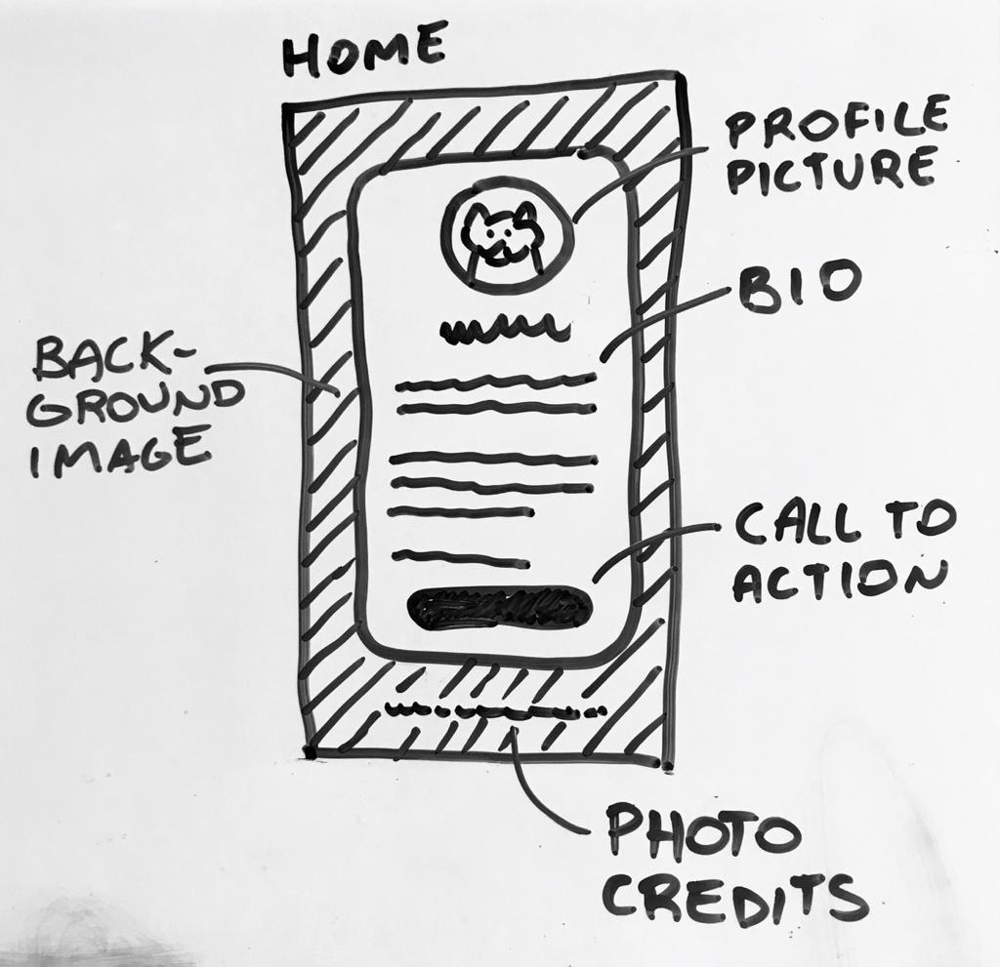
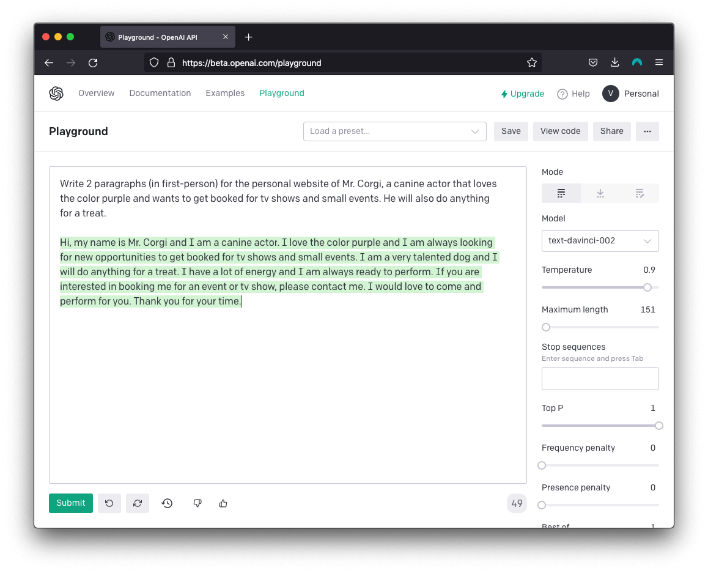

# Planning example

The following content is just a _fictional_ example of what I expect from Project 1’s “Planning” assignment.

Disclaimer: it is a bit nonsense.

## What is its purpose?

> Promote Mr. Corgi, my canine actor, so he gets hired to participate in TV shows & small events.

## What is its content?

The following content would initially be the home page of my _soon-to-be_ company, [pups4purple.com]().

### Home

> [Profile picture of smiling Corgi]
>
> Mr. Corgi
>
> Hi, my name is Mr. Corgi and I am a canine actor. I love the color purple and I am always looking for new opportunities to get booked for tv shows and small events. I am a very talented dog and I will do anything for a treat. 🍪
>
> I have a lot of energy and I am always ready to perform. If you are interested in booking me for an event or tv show, please contact me. I would love to come and perform for you. Thank you for your time. 💜
>
> Book me to satisfy all your Corgi needs:
>
> mrcorgi@purple-pups.com

## What could it look like?

Here is rough (annotated) sketch for the mobile version:

---

## Assets

### Profile

Source: [Wikimedia Commons](https://commons.wikimedia.org/wiki/File:Fawn_and_white_Welsh_Corgi_puppy_standing_on_rear_legs_and_sticking_out_the_tongue.jpg)

### Background

Source: [Unsplash](https://unsplash.com/photos/2JsSnODck0Y)

## Side notes

### AI

For a creativity boost, almost all of the text used on the website for Mr. Corgi was generated by [OpenAI](https://beta.openai.com/overview) using text completion (ChatGPT’s older cousin). Here is my prompt:

### Cross-browser support

One of the features I would like to use on the final website is the CSS property `background-attachment: fixed;`. [Here](https://www.w3schools.com/CSSref/pr_background-attachment.asp) you can read more about it.

It works in all major browsers, but Apple has not implemented it on iPhones and iPads, so the background images scroll along with the rest of the content – [which gets people mad](https://developer.apple.com/forums/thread/99883).
