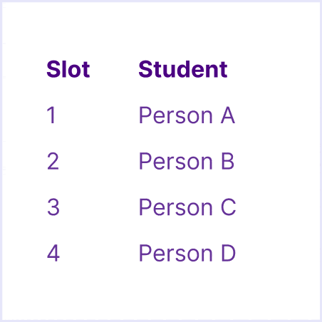
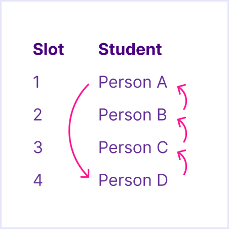

<link rel="stylesheet" href="https://vsueiro.com/syllabus-generator/lib/timeline.css">

# Syllabus — Front End Fundamentals

This is the main document for the CIM 343/643-S course at University of Miami, spring 2025.

🗓 Classes on Tuesdays and Thursdays, from `3:30 PM` to `4:45 PM`.

<table>
  <thead>
    <tr>
      <th>Lecturer</th>
      <th>Email</th>
      <th>Office Hours</th>
    </tr>
  </thead>
  <tbody>
    <tr>
      <td><a href="https://com.miami.edu/profile/vinicius-sueiro/">Vinicius Sueiro</a></td>
      <td><a href="mailto:vss43@miami.edu">vss43@miami.edu</a></td>
      <td><a href="https://calendly.com/viniciussueiro/office-hours">Calendly</a></td>
    </tr>
  </tbody>
</table>

This document is subject to change.

## Course Description

This course focuses on job-ready skills and production workflow techniques in highest demand for front-end web developers. Students will learn, practice and demonstrate the skills and principles needed to make effective use of these technologies.

<small>Graduate students are expected to exhibit more critical thinking and more complex creative projects.</small>

### Course Goals

By the end of this course, students should be able to:

- Materialize ideas as interactive websites
- Collaborate with development teams efficiently
- Apply computational thinking skills to other fields

### Course Topics

In order to reach the desired goals, students will learn concepts and techniques related to the 3 core technologies of the web (with an emphasis on the last one):

- 🧱 [HTML](https://developer.mozilla.org/en-US/docs/Learn/Getting_started_with_the_web/HTML_basics) (to define structure and content)
- 🎨 [CSS](https://developer.mozilla.org/en-US/docs/Learn/Getting_started_with_the_web/CSS_basics) (to apply visual styles)
- ✨ [JS](https://developer.mozilla.org/en-US/docs/Learn/Getting_started_with_the_web/JavaScript_basics) (to make it dynamic & interactive)

This course also covers tools that help us organize and scale up our projects:

- [Visual Studio Code](https://code.visualstudio.com/) (to write code and preview it on your computer)
- [GitHub](https://github.com/) + [GitHub Desktop](https://github.com/apps/desktop) + [GitHub Pages](https://pages.github.com/) (to store and deploy your website)

Optionally:

- [CodeSandbox](https://codesandbox.io/) (to use frameworks without installing stuff)
- [React](https://reactjs.org/) or [Svelte](https://reactjs.org/) (to organize your website into components)
- [Squarespace Domains](https://domains.squarespace.com/) or similar (to rent a friendly name, like “example.com”)

All tools are free (or provide a free version), except custom domains. 💸

### Course Timeline

We will not learn everything at once. Instead, this course is split into a few steps. Each step builds on top of what we learned from the previous one. Here is what this progression looks like:

#### Presentation day

For each project, students will share their final **website** with the whole class. For the third project, students will also present their **planning** beforehand, so they can to get early feedback on their idea. In order to present, students need to sign-up for 5-min **presentation slots** (instructions will be provided via Blackboard).

#### Peer Feedback

During presentation days, each student must provide feedback to (→) at least 1 classmate, as illustrated below:

##### How does it work?

After one student presents, the next student provides feedback.

After the _last_ student presents, the _first_ student provides feedback.

_In other words: right before you present, you provide feedback for the student that has just presented._

Your feedback should be about your classmate’s project idea (conceptual) or its execution (technical), in the form of compliments, questions, or suggestions.

### Course Content

The following tables describe what you are expected to do before class (“Preparation”), what we will do during class (“Content”), and what we have done during class (“Materials”).

## Grading

I reserve the right to adjust the final grade according to class participation, attendance, overall quality of work, etc.

### Grading Breakdown

| Step                                      | Weight    | Assignment      | Task            | Points |
| ----------------------------------------- | --------- | --------------- | --------------- | ------ |
| Introduction                              | 10 Points | Expectations    | Submission      | 5      |
| \*                                        | \*        | Critique        | Submission      | 5      |
| Inspiration Days                          | 10 Points | Analyze         | Submission (4×) | 2.5    |
| Project 1: Customize a Guessing Game      | 20 Points | Website         | Presentation    | 10     |
| \*                                        | \*        | \*              | Peer Feedback   | 5      |
| \*                                        | \*        | \*              | Submission      | 5      |
| Project 2: Clone an Interactive Interface | 20 Points | Website         | Presentation    | 10     |
| \*                                        | \*        | \*              | Peer Feedback   | 5      |
| \*                                        | \*        | \*              | Submission      | 5      |
| Project 3: Web Experiment                 | 30 Points | Planning        | Presentation    | 5      |
| \*                                        | \*        | \*              | Peer Feedback   | 5      |
| \*                                        | \*        | Website         | Presentation    | 10     |
| \*                                        | \*        | \*              | Peer Feedback   | 5      |
| \*                                        | \*        | \*              | Submission      | 5      |
| Final Exam                                | 10 Points | Self-reflection | Submission      | 10     |

#### Missed a task?

Late submissions via Blackboard <em>will</em> be accepted during the semester, but with a **10% grade deduction**.

In case students miss an in-class presentation, they can still submit a video recording via Blackboard, also with a **10% grade deduction**. However, the peer feedback points will be lost.

### Grading Scale

| Grade | Points |
| ----- | ------ |
| A+    | ≥ 97   |
| A     | ≥ 93   |
| A-    | ≥ 90   |
| B+    | ≥ 87   |
| B     | ≥ 83   |
| B-    | ≥ 80   |
| C+    | ≥ 77   |
| C     | ≥ 70   |
| D+    | ≥ 65   |
| D     | ≥ 60   |
| F     | ≥ 0    |

## Office Hours

Students are welcome to schedule individual sessions with the instructor. Please use [Calendly](https://calendly.com/viniciussueiro/office-hours) to pick a specific time slot for our remote (Zoom) meeting. If you want to meet at another day, time, or place, please email your instructor to check availability.

## Policies

  
Attendance Policy

  

    Class attendance is critical to the success of hands-on classes, including class participation in discussions and completion of in-class assignments. All students are responsible for material covered in the classroom regardless of their presence; therefore, check the class Blackboard for announcements, assignment requirements and due dates. Do not email your instructor to find out what has been posted to Blackboard.
  

  
Religious Holy Day Policy

  

    It is the student’s obligation to provide faculty members with notice of the dates they will be absent for religious holy days, preferably before the beginning of classes but no later than the end of the first three (3) class days. Absences due to observance of religious holy days not pre-arranged within the first three class days may be considered unexcused and there is no obligation to allow any make up work, including examinations. Missing a class due to travel plans associated with a particular religious holy day does not constitute an excused absence. The University’s complete Religious Holy Day Policy can be found in the current <i>UM Bulletin</i>.
  
 

  
UM Academic Integrity Policy

  

    Students in this and all UM courses are bound by the
    <a href="https://fs.miami.edu/_assets/pdf/facultysenate/Documents/academic-integrity-policy-final-changes-accepted.pdf">University’s Academic Integrity Policy</a>. 
  
 

<!-- AI -->

  
Generative Artificial Intelligence

  

    ChatGPT and other Generative Artificial Intelligence (AI) software may be useful tools for enhancing learning, productivity, and creativity. For instance, they can assist with brainstorming, finding information, and creating materials, such as text, images, and other media. However, these tools must be used appropriately and ethically, and you must understand their limitations. In particular, it is important to realize that all AI software has the following limitations:
  
 
  <ul>
    <li>How output is arrived at is not clear as the internal processes used to produce a particular output within the generative AI cannot be determined.</li>
    <li>AI output is typically based on data harvested from unknown online sources. As such, it may reflect biases that should be acknowledged. AI output may also be inaccurate or entirely fabricated, even if it appears reliable or factual.</li>
    <li>AI evokes a range of intellectual property concerns; sourcing and ownership of information is often unclear and is currently the subject of ongoing litigation.</li>
  </ul>

  
If you use AI tools in any part of your work, you are responsible for the final product of that work, both academically and in the workforce.

  
<i>General AI Principles</i>

  <ol>
    <li>AI should help you think, not think for you. AI tools may be used to help generate ideas, frame problems, and perform research. It can be a starting point for your own thought process, analysis, and discovery. Do not use them to do your work for you, e.g., do not enter an assignment question into ChatGPT and copy and paste the response as your answer.</li>
    <li>The use of AI must be open and documented. The use of any AI in the creation of your work must be declared in your submission and explained. Your faculty can provide guidance as to the format and contents of the disclosure.</li>
    <li>Engage with AI Responsibly and Ethically. Engage with AI technologies responsibly, critically evaluating AI-generated outputs and considering potential biases, limitations, and ethical implications in your analysis and discussions. Ensure that the data used for AI applications are obtained and shared responsibly. Never pass off as your own work generated by AI.</li>
    <li>You are 100% responsible for your final product. You are the user; if the AI tool makes a mistake, and you use it, then it’s your mistake. If you don’t know whether a statement about any item in the output is true, then it is your responsibility to research it. If you cannot verify it as factual, you should delete it. You hold full responsibility for AI-generated content. Ideas must be attributed, and sources must be verified.</li>
    <li>These principles are in effect unless the instructor gives you specific guidelines for an assignment or exam. It is your responsibility to ensure you are following the correct guidelines. Not following them will result in a breach of the Academic Integrity Policy.</li>
    <li>Data that are confidential or personal should not be entered into generative AI tools. Putting confidential or personal data into these tools exposes you and others to the loss of important information. Therefore, do not do so. See point 3 above.</li>
    <li>The rules and practices on the use of AI may vary from class to class, discipline to discipline. Do not assume that what is acceptable in a Computer Science class will be acceptable in a Philosophy class. It is the student’s responsibility to stay informed as to the instructor’s expectations. When in doubt, ask.</li>
  </ol>

  
<i>SoC-Specific Principles for the Use of AI</i>

  
Please adhere to the following overarching institutional principles for the use of AI systems in any SoC coursework:

  <ul>
    <li>Unless expressly approved by the instructor in writing, AI system outcomes should <u>not</u> be incorporated in final submissions or deliverables. They should solely be employed for process and research purposes.</li>
    <li>Students must properly cite the AI systems and document the pertinent prompts utilized during their process and research in the final assignment outcomes.</li>
    <li>Unless expressly approved by the instructor in writing, refrain from using the names of artists, designers, companies, or brands within the prompts. This is to uphold the artistic integrity of those involved.</li>
    <li>The instructor must ensure equitable access to any AI systems utilized in the course. This means that platforms used by students to meet course requirements must be freely accessible or offered through a UM-provided subscription.</li>
  </ul>

  
Respect and Civility in the Classroom

  
The School of Communication is committed to providing a safe, comfortable and inclusive learning environment that promotes a culture of respect and civility for everyone. Disruptive, rude, discriminatory, or disrespectful behavior toward the instructor, guest lecturers, or your fellow students will not be tolerated. Students who exhibit disruptive or uncivil behavior will be required to leave the classroom.

    
Intellectual Property

    

      Pursuant to the University’s Policy on Inventions, Intellectual Property, and Technology Transfer, “courseware” includes course syllabi, assignments, assessments, software, and/or other materials that are first created and made available to students as part of the educational curriculum at the University. Courseware is owned by the faculty member, unless otherwise agreed to beforehand in a written contract between the University and the faculty member. This policy and position have not changed due to recent circumstances and this policy and definitions apply to all means by which the course material is provided.
    

    

      The instructor is the copyright owner of the courseware; individual recordings of the materials on Blackboard and/or of the course sessions are not allowed; and such materials cannot be shared outside the physical or virtual classroom environments.
    

    
Honor Code and Plagiarism Statements

    

      Students enrolled in this course are expected to abide by the University of Miami Honor Code. The purpose of the Honor Code is to protect the academic integrity of the University by encouraging consistent ethical behavior in assigned coursework. Academic dishonesty of any kind, for whatever reason, will not be tolerated.
    

    

      No honest student wants to be guilty of the intellectual crime of plagiarism, even unintentionally. Therefore, we provide you with these guidelines so that you don't accidentally fall into the plagiarism trap.
    

    

      Plagiarism is the taking of someone else's words, work, or ideas, and passing them off as a product of your own efforts. Plagiarism may occur when a person fails to place quotation marks around someone else's exact words, directly rephrasing or paraphrasing someone else's words while still following the general form of the original, and/or failing to issue the proper citation to one's source material.
    

    

      In student papers, plagiarism is often due to…
    

    <ul>
      <li>turning in someone else's paper as one's own</li>
      <li>using another person's data or ideas without acknowledgment</li>
      <li>failing to cite a written source (printed or internet) of information that you used to collect data or ideas</li>
      <li>copying an author's exact words and putting them in the paper without quotation marks</li>
      <li>rephrasing an author's words and failing to cite the source</li>
      <li>copying, rephrasing, or quoting an author's exact words and citing a source other than where the material was obtained. (For example, using a secondary source which cites the original material, but citing only the primary material. This misrepresents the nature of the scholarship involved in creating the paper. If you have not read an original publication, do not cite it in your references as if you have!)</li>
      <li>using wording that is very similar to that of the original source, but passing it off as one's own.</li>
    </ul>
    
The last item is probably the most common problem in student writing. It is still plagiarism if the student uses an author's key phrases or sentences in a way that implies they are his/her own, even if s/he cites the source.

## Well-Being Resources and Support

As you complete your coursework, consider how you can maintain your health and well-being as a top priority. To help you become familiar with the many programs and services available on campus, review the information collected on the Division of Student Affairs Student Well-Being and Resiliency website available at [miami.edu/well-being](https://miami.edu/well-being).

Please reach out to any of the resources on the site if you need support throughout the semester.

## Learn More

There are a _lot_ of learning resources out there. This course does not intend to replace any of those. Instead, we heavily rely on them. Here are some good free learning resources:

- [W3Schools](https://www.w3schools.com/) (simplified documentation)
- [MDN Web Docs](https://developer.mozilla.org/) (advanced documentation)
- [freeCodeCamp](https://www.freecodecamp.org/) (beginner-friendly courses)
- [Codecademy](https://www.codecademy.com/learn/introduction-to-javascript/modules/learn-javascript-introduction/cheatsheet) (great JavaScript cheatsheet)
